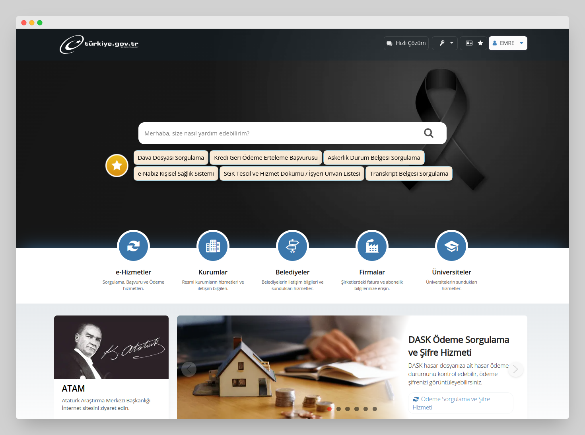
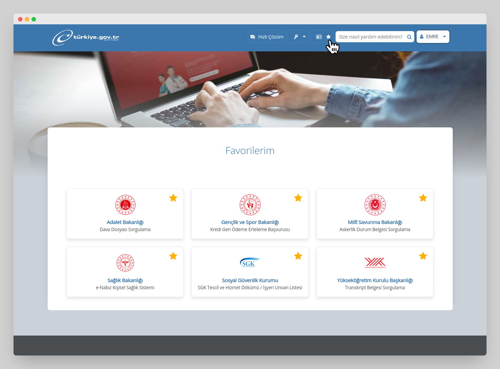
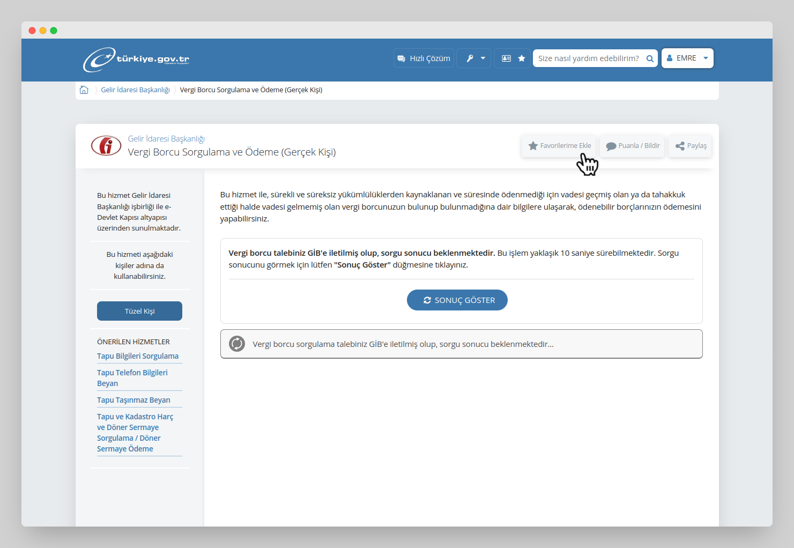

<h1 align="center"> e-Devlet Favoriler</h1>

Bu Chrome eklentisi, [turkiye.gov.tr](https://turkiye.gov.tr)'de kullanıcıların favori işlemlerini arama kutusunun altında listelemektedir.

## Problem Tanımı
e-Devlet Favoriler, [turkiye.gov.tr](https://turkiye.gov.tr) (e-Devlet Kapısı) kullanıcılarının sık kullandıkları işlemleri arama kutusuna yazarak aratmak yerine, favori işlemler listesi altında doğrudan istedikleri hizmet sayfasına erişmelerini sağlayarak zaman kazandırmayı hedeflemektedir. Bu sayede kullanıcılar, aradıkları işlemleri hızlı ve kolay bir şekilde gerçekleştirebilirler. Dolayısıyla, eklentinin çözmeye çalıştığı sorun, turkiye.gov.tr kullanıcılarının zaman tasarrufu yapmalarına yardımcı olmaktır.

### 🇬🇧 English
e-Devlet Favoriler ("e-Government Favorites"), aims to save time for users of the Turkey e-Government Portal ([turkiye.gov.tr](https://turkiye.gov.tr)) by allowing them to directly access their frequently used services from a list of favorite transactions, instead of having to search for them using the search box. This way, users can quickly and easily perform the transactions they need. Therefore, the extension's purpose is to assist turkiye.gov.tr users in making time-saving operations.

## Özellikler
 - Kullanıcıya ait favori işlemleri arama kutusu altında listeler.

## Ekran Görüntüleri
| Favori hizmetlerinizi arama kutusu altında görüntüleyin. |
| -------- |
||

| Favorilerinizi yönetin. |
| -------- |
||

| İstediğiniz hizmeti favorilerinize atın. |
| -------- |
||

## Kurulum
**Google Chrome** ya da **Brave** için:
1. Go to [Google Chrome Web Store](#)

VEYA

1. Releases'den [güncel sürümü indirin](https://github.com/emrecoban/e-devlet-fav/releases/tag/v1.0).
2. Sıkıştırılmış ZIP dosyasını açın.
3. Chrome/Brave'de eklentiler sayfasına gidin (chrome://extensions veya brave://extensions).
4. Geliştirici modunu aktif edin.
5. Klasörü sürükleyin ve bırakın veya "load unpacked" düğmesine tıklayın.

## Katkıda Bulunma
Hata raporları, özellik talepleri ve pull request'ler memnuniyetle karşılanmaktadır. Bu proje, işbirliği için güvenli ve hoşgörülü bir ortam olmayı amaçlamaktadır ve katkıda bulunanların, [Katılımcı Anlaşması](https://www.contributor-covenant.org/)'nın davranış kurallarına uyması beklenmektedir.

## Destek
- GitHub'da bana sponsor ol.
- Bu repo'ya yıldız ver.
- [Google Chrome Web Store](#) üzerinden bir değerlendirme bırak.
- Beni Twitter'dan ya da GitHub'dan takip et: [@emreshepherd](https://twitter.com/emreshepherd) - [@emrecoban](https://github.com/emrecoban).
- Bana kahve ısmarla: https://www.buymeacoffee.com/emrecoban

## Referanslar
- CRXJS
- cheerio

## Sürüm Günlükleri
- **[v1.0](https://github.com/emrecoban/e-devlet-fav/releases/tag/v1.0):** İlk sürüm yayınlandı!

## Lisans
e-Devlet Favoriler, [MIT Lisansı](https://github.com/emrecoban/e-devlet-fav/blob/main/LICENSE) şartları altında açık kaynak olarak kullanıma sunulmaktadır.